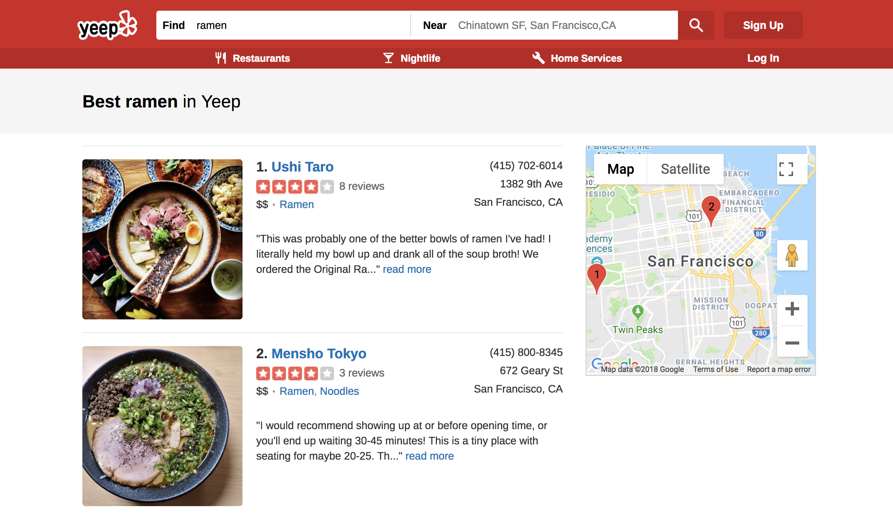
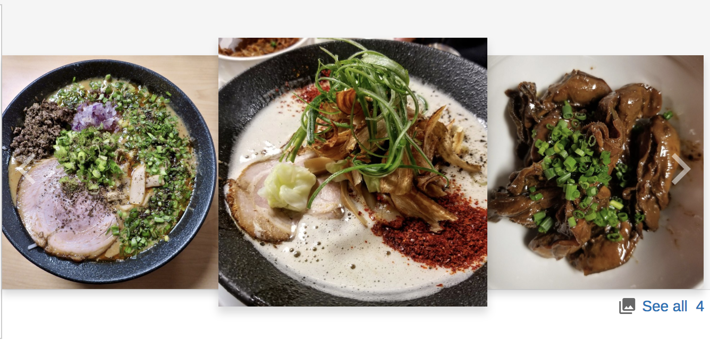
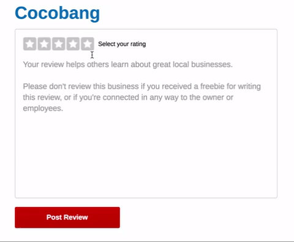

# Yeep
[Yeep Live](https://yeep.herokuapp.com/#/)


Yeep is a Yelp clone that allows users to browse any businesses in any location. Additionally, users can also view and write reviews for these businesses in which potential customers can get an idea of the business before they actually make a visit.

## Technologies
* Ruby on Rails on backend
* PostgreSQL for backend database
* React.js and Redux on frontend
* HTML and CSS

## Features
* Maintain user authentication security from frontend to backend using BCrypt.
* Users can search business by name, category, and location.
* Users can find business results on the google map using GoogleMap API.
* Display a business information in an organized layout.
* Users can upload a picture to a business using Amazon Web Services.
* Users can write and edit review for businesses.

#### Search
Users can search any businesses by typing the business name, category, and location. If users did not type in any location, the default location is San Francisco right now. After users click on the search button, it will give back a list of related businesses to users.



The center of the map will be set to the location a user types in. In addition, The map points out the location of each business in the list and have a number on each marker that references the business in the list. This was accomplished by using the GoogleMap APIs.

#### Showing Business Pictures
A business only show three photos on its show page.


The photo in the center pops out. When a user hover on the other picture, that picture will pops out. In addition, there are pre-image button and next-image button on the left and right side, user can click on those to look at other photos.

I accomplished this by setting the state of my Biz Show component with the photos index to limit the number of showing photos.
```Javascript
class PicBox extends React.Component {
  constructor(props) {
    super(props);
    this.state = {
      imgStart: 0,
      imgEnd: 3
    };
  }
  // when user click on the next-button, it will reset my state of photo slicing range
  nextImg() {
    if (this.state.imgEnd === this.props.photos.length) return;
    this.setState({
      imgStart: this.state.imgStart + 1,
      imgEnd: this.state.imgEnd + 1
    });
  }

  prevImg() {
    if (this.state.imgStart === 0) return;
    this.setState({
      imgStart: this.state.imgStart - 1,
      imgEnd: this.state.imgEnd - 1
    });
  }
}
```

#### Rating Stars in Review Form
Logged in users can write and update their review for a business. In the review form, the rating stars background can automatically response with specific rating score and rating message to a user's hover event.




Here is how I accomplished this:
```Javascript
// each time a user hover on a star, it updates the tag's backgroundPosition to show the right rating background.
updateMsg(tag, pos) {
  return (e) => {
    e.preventDefault();
    const label = document.querySelector(tag);
    const el = document.getElementById('rating-msg');
    el.innerText = label.innerText;
    const stars = document.querySelector('div.stars');
    stars.style.backgroundPosition = pos;
  };
}

// each time a user has mouse leave on a star, it removes that tag's backgroundPosition attribute.
removeMsg() {
  return (e) => {
    e.preventDefault();
    const el = document.getElementById('rating-msg');
    el.innerText = this.state.msg;
    const stars = document.querySelector('div.stars');
    stars.style.backgroundPosition = this.state.starPos;
  };
}
```

## Possible future features
* User profile page
* Get user's current location on the search bar
